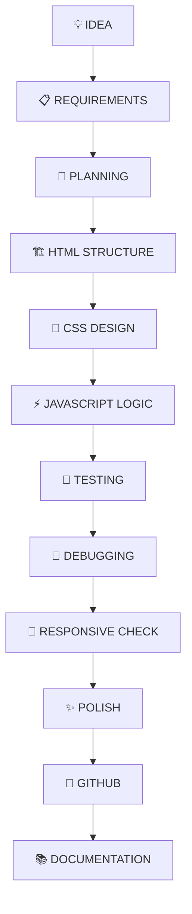

<div align="center">


<br>

<a href="https://github.com/rashid1351">

</a>

<a href="https://github.com/rashid1351/CodeAlpha_FrontendTasks">

</a>

<a href="https://github.com/rashid1351/CodeAlpha_FrontendTasks">

</a>

<a href="https://github.com/rashid1351/CodeAlpha_FrontendTasks">

</a>

<br><br>


<br><br>


<br><br>

---

### ⚡ DESIGN • CODE • INTERACTION • EXPERIENCE

> **"Don't just build interfaces. Build experiences people remember."**

</div>

---

# 👨‍💻 M. RASHID AZAM — CODEALPHA FRONTEND JOURNEY

<div align="center">

```text
╔══════════════════════════════════════════════════════════════════════╗
║                                                                      ║
║                       👨‍💻 M. RASHID AZAM                             ║
║                                                                      ║
║                         FRONTEND DEVELOPER                           ║
║                                                                      ║
║                CODEALPHA FRONTEND DEVELOPMENT                       ║
║                                                                      ║
║        🖼️ IMAGE GALLERY     🧮 CALCULATOR                           ║
║        💼 PORTFOLIO         🎵 MUSIC PLAYER                         ║
║                                                                      ║
║        HTML5  •  CSS3  •  JAVASCRIPT  •  RESPONSIVE UI              ║
║                                                                      ║
║                    🚀 BUILDING DIGITAL EXPERIENCES                  ║
║                                                                      ║
╚══════════════════════════════════════════════════════════════════════╝
```

</div>

<table>
<tr>
<td width="50%" valign="top">

## 👤 Developer Identity

* **Name:** M. Rashid Azam
* **GitHub:** `rashid1351`
* **Role:** Frontend Developer
* **Program:** CodeAlpha Frontend Development Internship
* **Repository:** `CodeAlpha_FrontendTasks`
* **Domain:** Frontend Development
* **Primary Stack:** HTML5 / CSS3 / JavaScript
* **Project Count:** 4

</td>

<td width="50%" valign="top">

## 🎯 Engineering Focus

* 🎨 Modern UI / UX
* 📱 Responsive Interfaces
* ⚡ Interactive JavaScript
* 🖼️ Visual Experiences
* 🧮 Functional Applications
* 💼 Personal Branding
* 🎵 Browser Audio
* ✨ Animation & Motion
* 🧠 Vanilla Web Technologies

</td>
</tr>
</table>

---

# 🌐 DIGITAL PRESENCE

<div align="center">

| Platform      | Destination               |
| :------------ | :------------------------ |
| 👨‍💻 GitHub  | `github.com/rashid1351`   |
| 📦 Repository | `CodeAlpha_FrontendTasks` |
| 🌐 Portfolio  | `rashidazam.me`           |
| 📂 Projects   | GitHub Repositories       |

</div>

---

# 🧠 ABOUT THIS REPOSITORY

**CodeAlpha_FrontendTasks** is a dedicated collection of frontend development projects created during the **CodeAlpha Frontend Development Internship**.

The repository demonstrates the practical application of frontend fundamentals through multiple independent projects.

Instead of relying on a single application, the work is divided into focused experiences:

```text
                         CODEALPHA
                             │
                             ▼
                  FRONTEND DEVELOPMENT
                             │
            ┌────────────────┼────────────────┐
            │                │                │
            ▼                ▼                ▼
        STRUCTURE          STYLE         INTERACTION
            │                │                │
            ▼                ▼                ▼
          HTML              CSS         JAVASCRIPT
            │                │                │
            └────────────────┼────────────────┘
                             ▼
                      USER EXPERIENCE
                             │
                             ▼
                    🚀 FOUR PROJECTS
```

The objective is simple:

> **Learn the fundamentals. Build complete experiences. Refine every detail.**

---

# 🧬 PROJECT DNA

```javascript
const codeAlphaFrontend = {

    developer: "M. Rashid Azam",

    repository: "CodeAlpha_FrontendTasks",

    domain: "Frontend Development",

    stack: [
        "HTML5",
        "CSS3",
        "JavaScript ES6+"
    ],

    projects: {

        task01: "LUMINA — Image Gallery",

        task02: "CALYX — Advanced Calculator",

        task03: "Personal Portfolio",

        task04: "SONORA — Music Player"

    },

    principles: [
        "Responsive Design",
        "Interactive UI",
        "Visual Hierarchy",
        "Smooth Motion",
        "Accessibility",
        "Maintainability",
        "User Experience"
    ],

    philosophy:
        "Build useful things. Make them feel intentional."
};
```

---

# 🏗️ FRONTEND ENGINEERING STACK

<div align="center">


<br><br>


</div>

---

# ⚡ TECHNOLOGY BREAKDOWN

## 🌐 HTML5

Used for:

* Semantic structure
* Accessible markup
* Content organization
* Forms and controls
* Media elements
* Application structure

---

## 🎨 CSS3

Used for:

* Responsive layouts
* Flexbox
* CSS Grid
* Animations
* Transitions
* Hover states
* Themes
* Visual hierarchy
* Adaptive interfaces

---

## ⚡ JAVASCRIPT ES6+

Used for:

* DOM manipulation
* Event handling
* Application logic
* State changes
* Interactive components
* Keyboard controls
* Audio controls
* Dynamic rendering
* Browser APIs

---

# 🎯 CODEALPHA TASK MATRIX

<div align="center">

| TASK | PROJECT          | PRIMARY OBJECTIVE  |    STATUS   |
| :--: | :--------------- | :----------------- | :---------: |
| `01` | 🖼️ **LUMINA**   | Image Gallery      | 🟢 COMPLETE |
| `02` | 🧮 **CALYX**     | Calculator         | 🟢 COMPLETE |
| `03` | 💼 **PORTFOLIO** | Personal Portfolio | 🟢 COMPLETE |
| `04` | 🎵 **SONORA**    | Music Player       | 🟢 COMPLETE |

### `04 / 04 PROJECT EXPERIENCES`

</div>

---

# 🖼️ TASK 01 — LUMINA

<div align="center">


### **IMMERSIVE IMAGE GALLERY**

`SEE • EXPLORE • FILTER • FOCUS`

</div>

## ✦ Concept

**LUMINA** is a visual gallery experience designed around immersive image browsing.

The project transforms a conventional gallery into an interactive visual interface using modern CSS and JavaScript-powered navigation.

### ✨ Experience

```text
IMAGE
  │
  ▼
GALLERY
  │
  ├──── HOVER
  │
  ├──── FILTER
  │
  └──── SELECT
          │
          ▼
       LIGHTBOX
          │
     ┌────┴────┐
     ▼         ▼
  PREVIOUS    NEXT
```

### ⚙️ Core Features

* 🖼️ Responsive image gallery
* 🔍 Lightbox viewing
* ◀️ Previous navigation
* ▶️ Next navigation
* ✨ Hover interactions
* 🌀 Smooth transitions
* 📱 Responsive layouts
* 🏷️ Image categories / filtering
* 🎨 Visual-first interface

### 🧠 Skills Demonstrated

```text
HTML STRUCTURE
      +
CSS GRID
      +
RESPONSIVE DESIGN
      +
JAVASCRIPT EVENTS
      +
LIGHTBOX LOGIC
      +
UI ANIMATION
```

### STATUS

<div align="center">

`████████████████████████████████` **100%**

**TASK 01 — COMPLETE**

</div>

---

# 🧮 TASK 02 — CALYX

<div align="center">


### **PRECISION • INTERACTION • CONTROL**

`CALCULATE • MANAGE • REVIEW • REPEAT`

</div>

## ✦ Concept

**CALYX** is a modern calculator interface built around functionality, visual clarity and interactive feedback.

The experience goes beyond a simple four-operation calculator by focusing on practical interaction and polished presentation.

### ⚡ Calculation Flow

```text
              USER INPUT
                   │
                   ▼
             🧮 EXPRESSION
                   │
                   ▼
             🧠 PARSER / LOGIC
                   │
                   ▼
              CALCULATION
                   │
                   ▼
             📺 RESULT DISPLAY
                   │
                   ▼
               HISTORY
```

### ✨ Features

* ➕ Addition
* ➖ Subtraction
* ✖️ Multiplication
* ➗ Division
* 🔄 Clear / reset
* ⌨️ Keyboard support
* 🧠 Calculation handling
* 📜 History
* 💾 Memory operations
* 🌙 Theme support
* 📱 Responsive layout
* ✨ Animated interaction

### 🧠 Skills Demonstrated

```text
DOM MANIPULATION
      +
EVENT HANDLING
      +
KEYBOARD INPUT
      +
CALCULATION LOGIC
      +
UI STATE
      +
RESPONSIVE CSS
```

### STATUS

<div align="center">

`████████████████████████████████` **100%**

**TASK 02 — COMPLETE**

</div>

---

# 💼 TASK 03 — PERSONAL PORTFOLIO

<div align="center">


### **A PERSONAL DIGITAL PRESENCE**

`INTRODUCE • SHOWCASE • CONNECT`

</div>

## ✦ Concept

The portfolio project focuses on presenting a developer's identity, capabilities and work through a responsive personal website.

### 🧭 Information Architecture

```text
                    PORTFOLIO
                       │
        ┌──────────────┼──────────────┐
        ▼              ▼              ▼
      ABOUT          SKILLS         PROJECTS
        │              │              │
        └──────────────┼──────────────┘
                       ▼
                    RESUME
                       │
                       ▼
                    CONTACT
```

### ✨ Core Areas

* 👤 About section
* 🧠 Skills showcase
* 🚀 Projects
* 📄 Resume
* 📬 Contact information
* 🧭 Navigation
* 🌀 Smooth scrolling
* ✨ Animations
* 🖱️ Hover interactions
* 📱 Responsive design

### 🎨 Design Goals

```text
CLARITY
  ↓
PERSONAL BRAND
  ↓
VISUAL HIERARCHY
  ↓
PROJECT DISCOVERY
  ↓
CONTACT
```

### STATUS

<div align="center">

`████████████████████████████████` **100%**

**TASK 03 — COMPLETE**

</div>

---

# 🎵 TASK 04 — SONORA

<div align="center">


### **SOUND, IN MOTION.**

`PLAY • FEEL • CONTROL • DISCOVER`

</div>

## ✦ Concept

**SONORA** is an immersive browser-based music player created with **Vanilla JavaScript**.

It combines audio functionality with a premium visual interface, responsive controls, dynamic track information and interaction-heavy UI.

### 🎧 Playback Architecture

```text
                         🎵 SONORA
                            │
             ┌──────────────┼──────────────┐
             │              │              │
             ▼              ▼              ▼
          PLAYBACK       PLAYLIST       CONTROLS
             │              │              │
        ┌────┼────┐         │         ┌────┼────┐
        ▼    ▼    ▼         ▼         ▼    ▼    ▼
      PLAY PAUSE NEXT     TRACK     PREV NEXT VOLUME
             │
             ▼
          PROGRESS
             │
             ▼
           AUDIO
```

### ✨ Features

* ▶️ Play
* ⏸️ Pause
* ⏮️ Previous
* ⏭️ Next
* 🔀 Shuffle
* 🔁 Repeat
* 🎚️ Volume control
* 📊 Progress bar
* ⏱️ Duration display
* 🎵 Track title
* 🎤 Artist information
* 📃 Playlist
* ⌨️ Keyboard interaction
* 📱 Responsive interface
* ✨ Motion-heavy UI
* 🛡️ Error handling

### 🧱 Project Structure

```text
Task-4-Music-Player/
│
├── assets/
│   └── media & visual resources
│
├── css/
│   └── interface styles
│
├── js/
│   └── player logic
│
├── index.html
└── README.md
```

### STATUS

<div align="center">

`████████████████████████████████` **100%**

**TASK 04 — COMPLETE**

</div>

---

# 🧩 COMPLETE FEATURE MATRIX

<div align="center">

| Capability           | LUMINA | CALYX | PORTFOLIO | SONORA |
| :------------------- | :----: | :---: | :-------: | :----: |
| HTML5                |    ✅   |   ✅   |     ✅     |    ✅   |
| CSS3                 |    ✅   |   ✅   |     ✅     |    ✅   |
| JavaScript           |    ✅   |   ✅   |     ✅     |    ✅   |
| Responsive UI        |    ✅   |   ✅   |     ✅     |    ✅   |
| Animations           |    ✅   |   ✅   |     ✅     |    ✅   |
| Hover Effects        |    ✅   |   ✅   |     ✅     |    ✅   |
| Interactive Controls |    ✅   |   ✅   |     ✅     |    ✅   |
| Keyboard Interaction |    —   |   ✅   |     —     |    ✅   |
| Dynamic Content      |    ✅   |   ✅   |     ✅     |    ✅   |
| Advanced UI          |    ✅   |   ✅   |     ✅     |    ✅   |

</div>

---

# 📁 REPOSITORY ARCHITECTURE

```text
CodeAlpha_FrontendTasks/
│
├── 🖼️ Task-1-Image-Gallery/
│   ├── 📄 README.md
│   ├── 📄 index.html
│   ├── 📄 script.js
│   └── 📄 style.css
│
├── 🧮 Task-2-Calculator/
│   ├── 📄 README.md
│   ├── 📄 index.html
│   ├── 📄 script.js
│   └── 📄 style.css
│
├── 💼 Task-3-Portfolio/
│   ├── 📄 README.md
│   ├── 📦 assets.zip
│   ├── 📄 index.html
│   ├── 📄 script.js
│   └── 📄 style.css
│
├── 🎵 Task-4-Music-Player/
│   ├── 📁 assets/
│   ├── 📁 css/
│   ├── 📁 js/
│   ├── 📄 README.md
│   └── 📄 index.html
│
└── 📄 README.md
```

> Each task is maintained as an independent frontend project.

---

# 🔄 DEVELOPMENT WORKFLOW



---

# 🧠 FRONTEND ENGINEERING PRINCIPLES

## 🎨 01 — VISUAL HIERARCHY

Important content should be immediately understandable.

## 📱 02 — RESPONSIVE FIRST

Interfaces should adapt naturally across screen sizes.

## ⚡ 03 — INTERACTION FEEDBACK

Every interaction should communicate a meaningful state.

## 🌀 04 — MOTION WITH PURPOSE

Animations should enhance the interface rather than distract from it.

## 🧹 05 — CLEAN STRUCTURE

HTML, CSS and JavaScript should remain understandable and maintainable.

## ♿ 06 — ACCESSIBILITY

Controls and interactions should remain usable across different input methods.

## 🚀 07 — USER EXPERIENCE

A project should not only function.

It should **feel good to use**.

---

# 📱 RESPONSIVE ENGINEERING

```text
                    RESPONSIVE SYSTEM
                           │
          ┌────────────────┼────────────────┐
          ▼                ▼                ▼
       📱 MOBILE        📲 TABLET       💻 DESKTOP
          │                │                │
          └────────────────┼────────────────┘
                           ▼
                    ADAPTIVE LAYOUT
                           │
                           ▼
                    CONSISTENT UX
```

The projects are designed around responsive behavior rather than treating mobile as an afterthought.

---

# ✨ UI / UX PHILOSOPHY

```text
                    USER
                     │
                     ▼
                  DISCOVER
                     │
                     ▼
                  INTERACT
                     │
                     ▼
                   FEEL
                     │
                     ▼
                 COMPLETE
                     │
                     ▼
                 REMEMBER
```

The goal of every project is to combine:

**Design + Functionality + Interaction + Responsiveness + Detail**

---

# 🧰 DEVELOPMENT TOOLKIT

<div align="center">


<br><br>


</div>

---

# 🚀 HOW TO RUN THE PROJECTS

## 01 — Clone

```bash
git clone https://github.com/rashid1351/CodeAlpha_FrontendTasks.git
```

## 02 — Enter Repository

```bash
cd CodeAlpha_FrontendTasks
```

## 03 — Select a Task

### Image Gallery

```bash
cd Task-1-Image-Gallery
```

### Calculator

```bash
cd Task-2-Calculator
```

### Portfolio

```bash
cd Task-3-Portfolio
```

### Music Player

```bash
cd Task-4-Music-Player
```

## 04 — Launch

Open:

```text
index.html
```

in a modern browser.

### Recommended Development Environment

```text
VS Code
   ↓
Live Server
   ↓
index.html
   ↓
Browser
   ↓
Interactive Experience
```

---

# 🧪 PROJECT QUALITY CHECKLIST

```text
[✓] Semantic HTML
[✓] Modern CSS
[✓] Vanilla JavaScript
[✓] Responsive layouts
[✓] Interactive components
[✓] Smooth transitions
[✓] Hover states
[✓] Mobile considerations
[✓] Keyboard interaction where applicable
[✓] Dynamic UI behavior
[✓] Project documentation
[✓] GitHub repository organization
```

---

# 🎓 CODEALPHA INTERNSHIP CONTEXT

The repository follows the **CodeAlpha Frontend Development** task structure.

The provided task brief includes four frontend projects:

```text
TASK 01 → IMAGE GALLERY
TASK 02 → CALCULATOR
TASK 03 → PERSONAL PORTFOLIO
TASK 04 → MUSIC PLAYER
```

The requirements emphasize HTML/CSS/JavaScript implementation, responsive interfaces, interactive behavior, smooth transitions and additional functionality where applicable.

The internship instructions state that participants must complete **a minimum of two or three of the listed tasks**, according to the program criteria, for completion eligibility.

---

# 📊 PROJECT COMPLETION

<div align="center">

```text
TASK 01  ████████████████████████████████  100%
TASK 02  ████████████████████████████████  100%
TASK 03  ████████████████████████████████  100%
TASK 04  ████████████████████████████████  100%

              ┌──────────────────────┐
              │   04 / 04 COMPLETE   │
              └──────────────────────┘
```

### `FOUR PROJECTS • ONE FRONTEND JOURNEY`

</div>

---

# 🗺️ FRONTEND DEVELOPMENT ROADMAP

```text
                         CURRENT
                            │
                            ▼
                  🌐 FRONTEND FOUNDATION
                            │
             ┌──────────────┼──────────────┐
             ▼              ▼              ▼
           HTML            CSS        JAVASCRIPT
             │              │              │
             └──────────────┼──────────────┘
                            ▼
                    🎨 UI / UX DESIGN
                            │
                            ▼
                   📱 RESPONSIVE UI
                            │
                            ▼
                    ⚡ INTERACTIONS
                            │
                            ▼
                    🧠 APPLICATION LOGIC
                            │
                            ▼
                    🚀 ADVANCED APPS
                            │
                            ▼
                    🤖 AI INTEGRATION
                            │
                            ▼
                  ⚙️ AUTOMATION SYSTEMS
                            │
                            ▼
                    🌍 PRODUCTION WEB
```

---

# 🔮 FUTURE IMPROVEMENTS

Possible future evolution of this repository:

```text
[ ] Add live demo links
[ ] Add project screenshots
[ ] Deploy projects with GitHub Pages
[ ] Add automated accessibility testing
[ ] Add performance audits
[ ] Add richer animations
[ ] Add automated CI checks
[ ] Expand project documentation
[ ] Add testing workflows
[ ] Continue building advanced frontend projects
```

---

# 📈 GITHUB ANALYTICS

<div align="center">


<br>


<br><br>


</div>

---

# 🧭 REPOSITORY MAP

```text
                           🌐 GITHUB
                              │
                              ▼
                 CodeAlpha_FrontendTasks
                              │
             ┌────────────────┼────────────────┐
             │                │                │
             ▼                ▼                ▼
        🖼️ LUMINA         🧮 CALYX        💼 PORTFOLIO
             │                │                │
             └────────────────┼────────────────┘
                              │
                              ▼
                         🎵 SONORA
                              │
                              ▼
                    FRONTEND DEVELOPMENT
                              │
                              ▼
                       USER EXPERIENCE
```

---

# 🏆 WHAT THIS REPOSITORY REPRESENTS

<div align="center">

```text
╔════════════════════════════════════════════════════════════╗
║                                                            ║
║                  CODEALPHA FRONTEND                        ║
║                                                            ║
║             FROM FUNDAMENTALS TO EXPERIENCE                ║
║                                                            ║
║        🖼️ VISUALS      🧮 LOGIC                           ║
║        💼 IDENTITY     🎵 INTERACTION                     ║
║                                                            ║
║              HTML5 • CSS3 • JAVASCRIPT                    ║
║                                                            ║
║              DESIGN • CODE • EXPERIENCE                   ║
║                                                            ║
╚════════════════════════════════════════════════════════════╝
```

</div>

---

# 🌐 PROJECT REPOSITORY

<div align="center">

<a href="https://github.com/rashid1351/CodeAlpha_FrontendTasks">

</a>

<br><br>

<a href="https://github.com/rashid1351">

</a>

</div>

---

# 👨‍💻 AUTHOR

<div align="center">

```text
╔════════════════════════════════════════════════════════╗
║                                                        ║
║                   M. RASHID AZAM                       ║
║                                                        ║
║                  FRONTEND DEVELOPER                    ║
║                                                        ║
║              HTML • CSS • JAVASCRIPT                   ║
║                                                        ║
║          BUILDING • LEARNING • CREATING                ║
║                                                        ║
╚════════════════════════════════════════════════════════╝
```

<br>

<a href="https://github.com/rashid1351">

</a>

<a href="https://github.com/rashid1351/CodeAlpha_FrontendTasks">

</a>

</div>

---

# 🔥 FINAL DEVELOPER STATEMENT

<div align="center">


<br><br>

# CODE. DESIGN. EXPERIENCE.

### **Frontend development is more than writing code.**

### **It is the art of turning ideas into experiences.**

<br>

`HTML5` • `CSS3` • `JAVASCRIPT` • `RESPONSIVE DESIGN` • `UI/UX`

<br>

<a href="https://github.com/rashid1351/CodeAlpha_FrontendTasks">

</a>

<br><br>

### ⚡ BUILD • LEARN • CREATE • INNOVATE • GROW ⚡

<br>

**Thanks for visiting the repository. ❤️**

</div>


